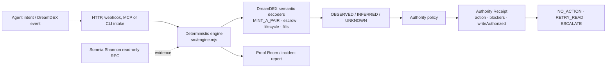

# Last Known Book

## Reconstruct the market your agent actually traded.

**Somnia × DreamDEX Event Contracts Hackathon**

Last Known Book is the execution-assurance layer for autonomous agents trading **DreamDEX Event Contracts on Somnia**. When a post-trade result looks wrong, it reconstructs **Agent Intent vs Venue Reality**, separates `OBSERVED / INFERRED / UNKNOWN`, and returns a bounded next action plus a deterministic **Authority Receipt**.

> The trading agent may be AI. The layer that decides whether money moves is not.

## Judge Fast Lane — 60 seconds

- [Live Demo](https://last-known-book.pages.dev) — open `LKB-001`.
- [Proof Room](https://last-known-book.pages.dev/proof.html) — originated Shannon behavior proof, live read-only witnesses, and visual commitment.
- [Agent Interface](https://last-known-book.pages.dev/agent.html) — HTTP, webhook, MCP, CLI and Authority Receipt contract.
- [Judge Packet](https://last-known-book.pages.dev/docs.html) — extended technical and submission evidence.
- [Demo video](https://youtu.be/S5TJPENjEYM) — current 2:02 cut; final audio-close review remains tracked in repository state.
- [Canonical repository](https://github.com/Faadil1/Last-Known-Book) — `main`.

**In 30 seconds:** an autonomous agent can make a valid first trade and still misunderstand the resulting venue state. **The risk is the second action:** a blind retry, compensation trade, cancel or redeem can then create a second financial mistake. Last Known Book starts after execution, reconstructs what DreamDEX actually did, and answers: **what happened, what do we know, and what is safe to do next?**

## The core loop



```text
Agent intent
    ↓
DreamDEX execution
    ↓
Last Known Book intake
    ↓
OBSERVED / INFERRED / UNKNOWN
    ↓
DreamDEX-native semantic explanation
    ↓
NO_ACTION / RETRY_READ / ESCALATE
    ↓
Deterministic Authority Receipt
```

Inference may explain an incident or request more evidence. It cannot authorize spend by itself. The public product and agent surfaces are read-only by default; the receipt does not sign or broadcast a transaction.

## Primary case: LKB-001

### This wasn't a whale. It was a mint.

LKB-001 contains two separate findings from the same captured incident. They must not be conflated:

| Finding | What the evidence says | Safe consequence |
| --- | --- | --- |
| **A — chain/indexer divergence** | The blockchain receipt shows the transaction succeeded, while the bounded indexed verification path is unavailable or lagging. | Do **not** resubmit. Return `RETRY_READ`; `WRITE_REFUSED`. A second write could duplicate an already successful execution. |
| **B — `MINT_A_PAIR`** | DreamDEX's mint-pair path explains the observed economics/activity that a naive directional-flow interpretation would misread. | Decode venue semantics before explaining the fill. `MINT_A_PAIR` did **not** cause the indexer lag. |

The memorable causal chain is:

```text
MINT_A_PAIR + CHAIN_INDEXER_DIVERGENCE
                    ↓
                RETRY_READ
                    ↓
              WRITE REFUSED
```

That is the difference between “the trade failed, try again” and “the chain says it succeeded; recover indexed visibility first.”

## Why DreamDEX is load-bearing

This is not generic blockchain analytics. DreamDEX Event Contract semantics change both the explanation of an execution and what an agent may safely do next:

- durable `marketId` identity, with rolling pool binding and rollover behavior;
- Event Contract lifecycle and current on-chain state;
- `MINT_A_PAIR` fill economics;
- resting `SELL` escrow, where visible inventory can move into venue custody;
- expected-vs-actual fill reconciliation;
- exact-market residual settlement;
- native `OrderPlaced`, `OrderRested` and `OrderCancelled` events.

Remove those semantics and the system cannot distinguish a mint from directional flow, escrow from lost inventory, an improved fill from an execution error, or a losing residual from a redeemable position. The safe next action changes with the explanation.

## Four incident classes

These are deterministic replays of captured Shannon evidence. They are not presented as transactions originated by Last Known Book.

| Case | What looks wrong | What the decoder establishes | Safe response |
| --- | --- | --- | --- |
| **LKB-001** · Mint + indexer lag | A successful call cannot be verified through the normal indexed path; economics look like directional flow. | `MINT_A_PAIR` plus chain/indexer divergence. | `RETRY_READ`; no resubmit. |
| **LKB-002** · Resting SELL escrow | Visible YES inventory appears to disappear while a sell rests. | Inventory is committed in venue escrow and returns on exact cancel; collateral reconciles. | `NO_ACTION`. |
| **LKB-003** · Requested is not executed | Actual average fill differs from the request. | The fill and resulting position reconcile, with an improved price. | `NO_ACTION`. |
| **LKB-004** · Residual settlement | Nonzero old-market token balances look redeemable. | Exact market, resolution and payout vector distinguish redeemed winners from known zero-value losers. | No repeat write; fresh predicates and human confirmation are required for any new redeem. |

## How it works

```text
case JSON / tx intake
        ↓
deterministic reconstruction
        ↓
DreamDEX semantic decoders
        ↓
truth classification + root cause
        ↓
authority policy
        ↓
incident report + Authority Receipt
```

The critical path is deterministic JavaScript in [`src/engine.mjs`](src/engine.mjs). It validates case invariants, decodes DreamDEX-specific semantics, computes reconciliation and produces a stable report hash. [`src/authority-receipt.mjs`](src/authority-receipt.mjs) turns that report into a machine-readable decision artifact.

### Truth classes

- **`OBSERVED`** — directly supported by input/source evidence or deterministic arithmetic.
- **`INFERRED`** — a bounded interpretation supported by observed claims.
- **`UNKNOWN`** — an unresolved evidence gap that may stop the system.

Inference alone cannot authorize spend. Unknowns remain visible instead of being converted into confidence.

### Authority Receipt

`LKB-AUTHORITY-RECEIPT-v0.1` includes the report hash, recommended action, truth counts, blocking unknowns and explicit authority flags:

```json
{
  "decision": {
    "recommendedAction": "RETRY_READ",
    "writeAuthorized": false,
    "canMoveFunds": false,
    "executionPerformed": false
  },
  "truthGate": {
    "observed": 5,
    "inferred": 2,
    "unknown": 1,
    "blockingUnknowns": ["U-MINT-1"]
  },
  "inferenceCanAuthorizeSpend": false
}
```

The values above illustrate the schema shape; a real receipt is generated from the selected case. The receipt can recommend or authorize under policy, but it never executes the decision. In this v0.1 implementation, public paths do not expose the protected blockchain write runner.

## Agent-native integration

The same engine is available to an agent runtime through these verified surfaces:

| Surface | Entry point | Purpose |
| --- | --- | --- |
| HTTP | `POST /api/investigate` | Bring-your-own incident or read-only transaction intake. |
| Webhook | `POST /api/incidents` | Provider-neutral inbound incident route using the same fail-closed path. |
| Remote MCP | `POST /api/mcp` | JSON-RPC `tools/list`, `tools/call`, `initialize` and `ping`. |
| Local MCP | `npm run mcp` | Newline-delimited JSON-RPC stdio adapter. |
| CLI | `npm run lkb -- ...` | JSON-first investigation, receipt and network checks. |
| Agent contract | [`SKILL.md`](SKILL.md) and [`/agent.html`](https://last-known-book.pages.dev/agent.html) | LLM-readable and judge-readable operating reference. |

The bounded MCP tools are `lkb_investigate`, `lkb_authority_receipt`, `lkb_network_normalization`, `lkb_convert_units` and `lkb_reproduce_case`. A bare transaction hash is not enough to invent DreamDEX semantics; insufficient evidence returns `UNKNOWN` with `RETRY_READ` or `ESCALATE` and `writeAuthorized:false`.

## Evidence and proof boundaries

Last Known Book deliberately separates four evidence categories:

1. **Captured replay evidence — LKB-001 through LKB-004.** Real Shannon incident classes from public source evidence, replayed deterministically by this repository. Last Known Book did not originate those transactions.
2. **Product-originated Shannon behavior proof — Packet 003.** On chain `50312`, Last Known Book revalidated the exact context, placed one `PostOnly` order, observed `0 fills`, observed `OrderPlaced → OrderRested`, cancelled the exact returned order, observed `OrderCancelled`, and reconciled tUSDC collateral `1 raw → 1 raw`.
3. **Live read-only witnesses.** The Proof Room checks current Shannon chain/head, a public captured LKB-003 receipt, DreamDEX `BinaryMarketsModule` bytecode and tUSDC `decimals()`. These are not additional product-originated trades; no wallet, signature or broadcast is used.
4. **Tamper-evident commitment.** [`/proof.html#commitment`](https://last-known-book.pages.dev/proof.html#commitment) binds the preserved private Packet 003 proof object to Git identities without publishing private wallet, order or transaction identifiers.

The evidence is technical, testnet and bounded. It does **not** claim production reliability, profitability, ROI, fraud detection, incident prevalence or measured MTTR improvement.

## Judge Fast Lane — 60 seconds

Have 60 seconds?

1. Open the [live product](https://last-known-book.pages.dev) and select **LKB-001**.
2. Follow `AGENT INTENT ≠ VENUE REALITY` → `MINT_A_PAIR + CHAIN_INDEXER_DIVERGENCE` → `RETRY_READ` → `WRITE REFUSED`.
3. Open the [Proof Room](https://last-known-book.pages.dev/proof.html) and distinguish the originated Packet 003 proof from the live read-only witnesses.
4. Open the [Agent Interface](https://last-known-book.pages.dev/agent.html) and inspect the bounded Authority Receipt.

## Run locally

Requires **Node.js 20+**. This repository has no runtime dependency install step beyond Node's built-ins.

```bash
npm test
npm run replay
npm run serve
```

Then open `http://localhost:4173`.

Optional read-only paths:

```bash
npm run live:read
npm run lkb -- investigate data/cases/mint-pair-indexer-lag.json
npm run lkb -- network-check shannon
npm run lkb -- network-check mainnet
npm run mcp
```

Protected Shannon write runners are not a one-command demo. Any additional write requires fresh exact human authorization and must pass chain, market, pool, lifecycle, book-parameter, gas, collateral, allowance, cutoff and closure predicates.

## Verification status

At the canonical checkout inspected for this README:

- `npm test` — **44 tests passed**.
- `npm run replay` — generates four machine-readable reports under `evidence/generated/`; the command is deterministic and writes no blockchain state.
- `state/CURRENT.yaml` records the canonical `main` runtime, GitHub Actions and Cloudflare Pages status, plus the remaining demo-audio gate.

The public deployment is sourced from canonical `main`; production evidence remains intentionally bounded and separate from local replay evidence.

## Repository map

- [`src/engine.mjs`](src/engine.mjs) — deterministic DreamDEX decoders, truth classes, policy and report hashing.
- [`src/authority-receipt.mjs`](src/authority-receipt.mjs) — receipt schema and authority boundary.
- [`api/`](api) — HTTP, webhook, MCP and read-only Shannon/network routes.
- [`scripts/`](scripts) — replay, CLI, local MCP, serving and read-only checks.
- [`data/cases/`](data/cases) — four canonical incident fixtures.
- [`evidence/`](evidence) — provenance, replay outputs and bounded proof artifacts.
- [`tests/`](tests) — engine, agent-surface, proof/redaction, UI and regression tests.
- [`proof.html`](proof.html) and [`agent.html`](agent.html) — judge-facing proof and integration surfaces.
- [`docs/SUBMISSION-PACKAGE.md`](docs/SUBMISSION-PACKAGE.md) — extended submission narrative and evidence matrix.

## Safety boundary and next steps

Last Known Book is an execution-assurance prototype, not a trading strategy or a promise of safe autonomous finance. It does not predict markets, guarantee reliability, move funds from an Authority Receipt or infer a DreamDEX root cause from a bare hash.

The credible adoption path is to persist immutable receipts keyed by durable market identity, expand the live incident corpus, measure an operator baseline, harden identity/privacy/action-policy controls and extend deterministic DreamDEX coverage before evaluating any production write authority.

As autonomous agents gain permission to trade Event Contracts, they also need infrastructure for understanding unexpected execution before taking another financial action. Last Known Book makes that pause concrete: **what happened, what do we know, and what is safe to do next?**
